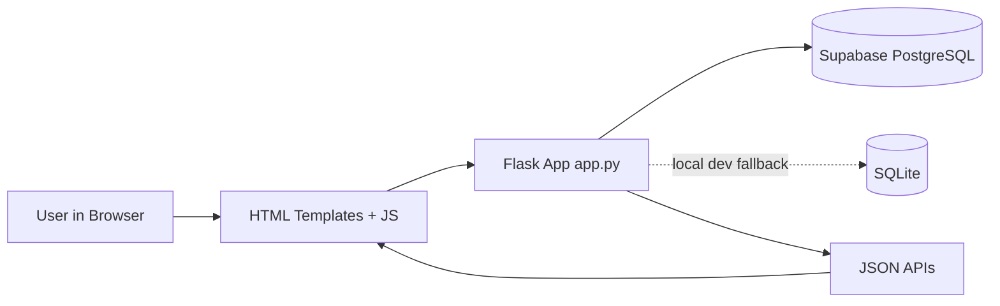
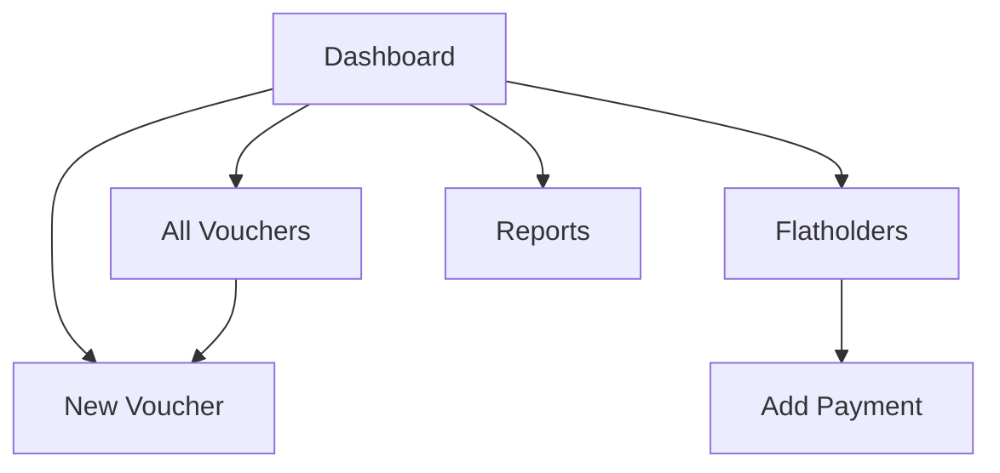
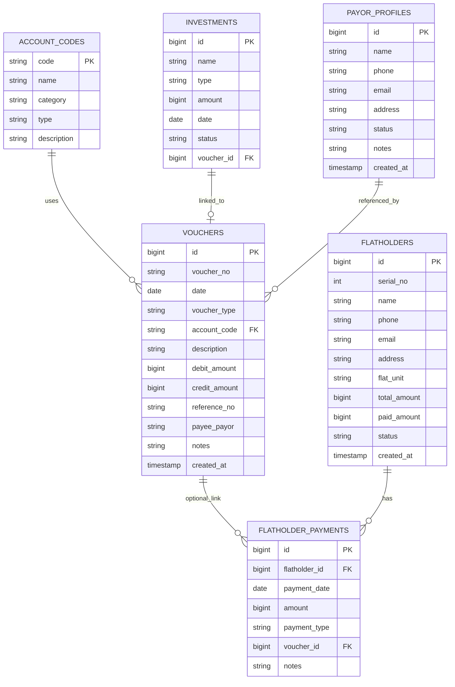
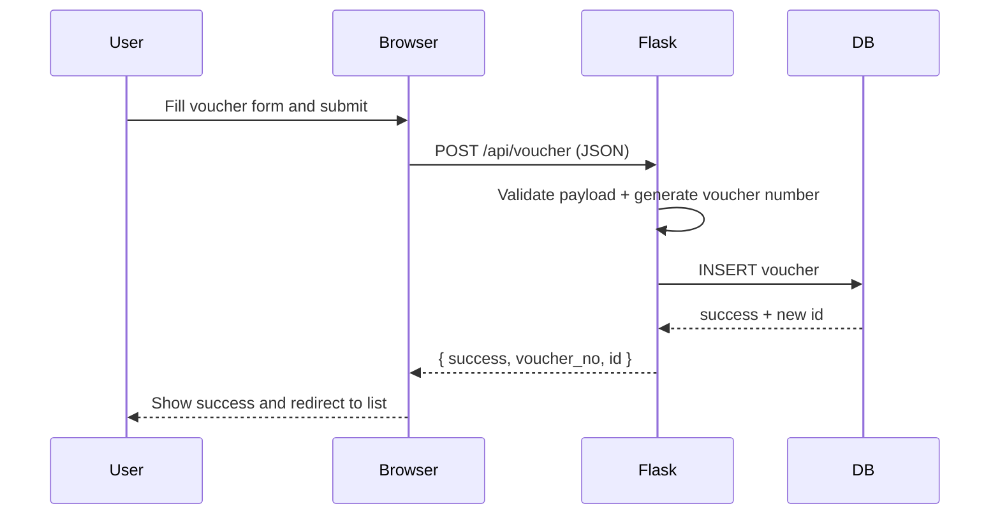

# APAN NIBASH Web App

A Flask financial management app for the APAN NIBASH project, backed by **Supabase** (PostgreSQL) with SQLite local dev fallback.

This app digitizes manual Excel-based bookkeeping:
- Record income, expenses, and journal entries with voucher numbers.
- Maintain flatholder payment records and dues.
- View dashboard summaries and report charts.
- Export voucher/flatholder data as JSON.

---

## 1) What This App Does

The app digitizes core financial workflows that were previously handled manually in spreadsheets:
- Voucher management (RV, PV, JV)
- Account-code based bookkeeping
- Flatholder master data and payment collection tracking
- Income/expense and balance reporting
- Dashboard-level live totals and trends

### Main value
- Faster data entry than manual sheets
- Consistent voucher numbering
- Built-in validation for common entry mistakes
- Centralized data storage in Supabase (PostgreSQL)
- Better visibility through dashboard + charts

---

## 2) Key Features

## 2.1 Dashboard
- Daily income and expense totals
- Net balance (total income minus total expense)
- Flatholder stats (total buyers + total collected)
- Recent transactions list
- Monthly income vs expense chart (loaded from report API)
- Quick actions for common tasks

## 2.2 Voucher Management
- Create vouchers with:
  - Date
  - Voucher type: RV, PV, JV
  - Account code
  - Description
  - Debit/Credit amount
  - Reference number
  - Payee/Payor
  - Notes
- Auto-generated voucher number format:
  - TYPE-YYYYMM-####
  - Example: RV-202604-0001
- Voucher list with filters:
  - Voucher type
  - Date range
  - Account code
  - Record limit
- Voucher delete action

## 2.3 Flatholder Management
- Add flatholders (serial no, name, contact, flat unit, total amount)
- Track payment status automatically:
  - NOT_PAID
  - PARTIAL
  - FULL
- Add flatholder payments with:
  - Payment date
  - Amount
  - Payment type (BOOKING / DOWN_PAYMENT / INSTALLMENT / FINAL)
  - Notes
- Live summary cards:
  - Total buyers
  - Total committed
  - Total collected
  - Total due

## 2.4 Reports
- Period report types:
  - Monthly
  - Yearly
  - Category-wise
- Chart visualization (income vs expense, or credit vs debit by category)
- Balance summary:
  - Total income
  - Total expense
  - Net amount
- Detailed account-wise balance table

## 2.5 API Utilities
- Export vouchers or flatholders in JSON
- Import endpoint exists as placeholder (currently not implemented)

---

## 3) System Architecture



---

## 4) Application Screens and Navigation



---

## 5) Data Model



---

## 6) Request Flow Example (Create Voucher)



---

## 7) Tech Stack

- Backend: Flask (Python)
- Database: Supabase (PostgreSQL) — primary; SQLite for local dev fallback
- Frontend: Server-rendered HTML templates + vanilla JavaScript
- UI framework: Bootstrap 5 + Bootstrap Icons
- Charts: Chart.js (CDN)
- Deployment: Render (starter plan)

---

## 8) Project Structure

- app.py: Flask routes, page rendering, APIs, validation (Supabase-first, SQLite fallback)
- database.py: Supabase client init, SQLite schema creation, default account seeds
- migrate_to_supabase.py: One-time SQLite → Supabase migration script
- supabase_schema.sql: Full Supabase table creation DDL
- supabase_fix_relationships.sql: Schema fixes (BIGINT columns, FK constraints)
- render.yaml: Render deployment config
- templates/: UI pages
  - dashboard.html
  - voucher_form.html
  - vouchers.html
  - flatholders.html
  - reports.html
- static/: reserved for custom static assets
- APAN_NIBASH_Complete_Summary.md: source business/accounting context

---

## 9) Setup and Run Instructions

## 9.1 Prerequisites
- Python 3.10+ recommended
- pip
- A [Supabase](https://supabase.com) project (free tier works)

## 9.2 Install dependencies
From the project root:

```bash
python3 -m venv .venv
source .venv/bin/activate
pip install -r requirements.txt
```

## 9.3 Supabase Setup

1. Create a project at https://supabase.com
2. Go to **SQL Editor** in the Supabase dashboard
3. Run `supabase_schema.sql` to create all tables and seed account codes
4. Run `supabase_fix_relationships.sql` to fix column types and add FK constraints
5. Go to **Project Settings → API** and copy:
   - **Project URL** → set as `SUPABASE_URL` env var
   - **service_role secret key** → set as `SUPABASE_KEY` env var

> **Important:** Use the `service_role` key (not `anon`), since the app needs full table access.

## 9.4 Migrate existing SQLite data (optional)

If you have existing data in a local SQLite database:

```bash
export SUPABASE_URL="your-project-url"
export SUPABASE_KEY="your-service-role-key"
python migrate_to_supabase.py --dry-run   # preview only
python migrate_to_supabase.py --apply     # actually migrate
```

## 9.5 Start the app (local development)

```bash
export SUPABASE_URL="your-project-url"
export SUPABASE_KEY="your-service-role-key"
python3 app.py
```

Without `SUPABASE_URL` and `SUPABASE_KEY` set, the app falls back to SQLite.

The app starts on:
- http://127.0.0.1:5001

## 9.6 First run behavior
- With Supabase: the app uses your Supabase project directly.
- With SQLite fallback: the app initializes the database automatically, creates tables if missing, and inserts default account codes.

---

## 10) Deploy to Render (Production)

This repository includes a `render.yaml` Blueprint config for one-click deployment.

### Step-by-step

1. **Push this project to GitHub** (if not already).

2. **Set up Supabase first** (see section 9.3 above). You need a live Supabase project with all tables created.

3. **Create a Render account** at https://render.com and connect your GitHub.

4. In Render dashboard, click **New + → Blueprint**.

5. Select this repository. Render will detect `render.yaml` automatically.

6. In the Blueprint setup, set these environment variables:
   - `SUPABASE_URL` — your Supabase project URL
   - `SUPABASE_KEY` — your Supabase service_role secret key
   - `AUTH_USERNAME` — login username (default: `admin`)
   - `AUTH_PASSWORD` — login password (auto-generated or set your own)
   - `SECRET_KEY` — Flask session secret (auto-generated)

7. Click **Apply**.

8. Wait for build + deploy to complete.

9. Open the generated URL and confirm:
   - `/` loads the dashboard
   - `/health` returns `{"status": "ok"}`

### Why Supabase + Render is the right combo

- Render is stateless between deploys — Supabase handles persistent data.
- No disk backups needed; Supabase manages its own backups.
- The free Supabase tier is generous enough for this app's data size.
- Render Starter plan keeps the app running without sleep.

### Environment Variables on Render

| Variable | Required | Notes |
|---|---|---|
| `SUPABASE_URL` | Yes | Supabase project URL |
| `SUPABASE_KEY` | Yes | service_role secret key |
| `SECRET_KEY` | Auto | Render generates one |
| `AUTH_USERNAME` | Yes | Dashboard login username |
| `AUTH_PASSWORD` | Auto | Render generates one (or set your own) |
| `PYTHON_VERSION` | Set | 3.11.9 |

---

## 10) How To Use (Step-by-Step)

## 10.1 Record an income or expense voucher
1. Open Dashboard.
2. Click Add Income or Add Expense (quick action), or go to New Voucher.
3. Fill required fields:
   - Date
   - Voucher Type
   - Account Code
   - Description
   - Appropriate amount
4. Click Save Voucher.
5. The app generates a voucher number and stores the entry.

## 10.2 Browse and filter vouchers
1. Open All Vouchers.
2. Apply filters (type/date/account/limit).
3. Click Filter.
4. Use delete button only when needed.

## 10.3 Add flatholders and collect payments
1. Open Flatholders.
2. Click Add Flatholder and fill buyer details.
3. Use Pay button on a flatholder row to record payment.
4. Watch due and status update automatically.

## 10.4 View reports
1. Open Reports.
2. Select period type (Monthly/Yearly/By Category).
3. Set year and click Load.
4. Review chart + account-wise balance table.

---

## 11) Business Rules and Validations

## Voucher creation validation
- Required: date, voucher_type, account_code, description
- debit_amount and credit_amount cannot be negative
- At least one amount must be greater than zero
- RV must have credit_amount > 0
- PV must have debit_amount > 0

## Flatholder validation
- serial_no and name are required
- total_amount cannot be negative

## Payment validation
- payment_date and payment_type are required
- payment amount must be > 0
- flatholder must exist

---

## 12) API Reference (Current)

## Pages
- GET /
- GET /voucher/new
- GET /vouchers
- GET /flatholders
- GET /reports

## Voucher APIs
- GET /api/vouchers
  - Query params: type, from_date, to_date, account_code, limit
- POST /api/voucher
- DELETE /api/voucher/<id>

## Flatholder APIs
- GET /api/flatholders
- POST /api/flatholder
- POST /api/flatholder/<id>/payment

## Report APIs
- GET /api/reports/period
  - Query params: period_type, year
- GET /api/reports/balance
- GET /api/dashboard/summary

## Data transfer helpers
- GET /api/export?type=vouchers|flatholders&format=json
- POST /api/import (placeholder, not implemented yet)

---

## 13) Notes and Current Limitations

- Basic session-based login is implemented (`/login` route).
- /api/import is a stub and does not process files yet.
- Export currently returns JSON only.
- No edit/update endpoints for vouchers yet (create/list/delete/payment only).
- Supabase REST API is used for all queries; SQLite fallback is available for local dev.
- Amounts are stored as BIGINT cents in the database. The app handles conversion automatically.

---

## 14) Suggested Next Enhancements

- Implement real Excel/CSV import pipeline with field mapping and validation report.
- Add update/edit flows for vouchers and flatholders.
- Add role-based login for accounting/admin users.
- Add soft-delete + audit log.
- Add downloadable CSV/PDF reports.
- Add automated backup and restore utilities.

---

## 15) Troubleshooting

## ModuleNotFoundError: flask or supabase
Install dependencies in your active environment:

```bash
pip install -r requirements.txt
```

## Supabase connection errors
- Verify `SUPABASE_URL` and `SUPABASE_KEY` are set correctly.
- Make sure you're using the **service_role** key (starts with `eyJ...`), not the `anon` key.
- Check your Supabase project is active at https://app.supabase.com

## Database file issues (SQLite fallback only)
- DB path is managed automatically as: data/apan_nibash.db
- Ensure app has write permission in project folder.

## Port already in use
Run on another port by setting the `PORT` env var:

```bash
PORT=5002 python3 app.py
```

## Migration errors
- Run `--dry-run` first to preview what will be migrated.
- Make sure `supabase_schema.sql` and `supabase_fix_relationships.sql` have been executed in Supabase SQL Editor before running the migration.

---

## 16) License and Project Context

This repository is part of an internal/business workflow modernization effort for APAN NIBASH financial records.

If you want, this README can be extended further with:
- API request/response JSON examples for every endpoint
- sample test data script
- operator manual in Bangla + English
